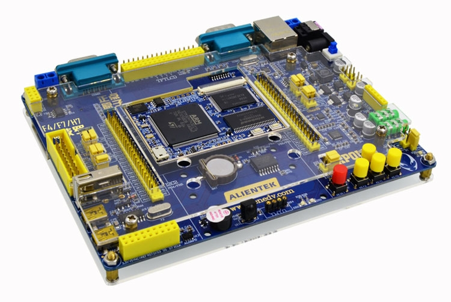

# apollo-f429 — STM32F429IGT6 development projects

Bare-metal projects for the **apollo-f429** board (STM32F429IGT6, F42x/F43x
family), built with **CMake/Ninja** (Pico-style), debugged/flashed over
**SWD** with a **Keil ULINK2** (CMSIS-DAP), with `printf()` streamed out
**USART1 (PA9/PA10)** at 115200 baud via a USB-serial virtual COM port.
The board is a close sibling of **`../fire-f429`** (same MCU, same 25 MHz
HSE, same 180 MHz clock tree) with a different pinout.



## Board facts

- MCU: **STM32F429IGT6** (Cortex-M4F @ up to **180 MHz**, FPU)
- Flash **1 MB** (`0x08000000`)
- SRAM **256 KB** = SRAM1 **112 K** + SRAM2 **16 K** + SRAM3 **64 K**
  (contiguous, `0x20000000`) + CCM **64 K** (`0x10000000`, not used by linker)
- HSE crystal **25 MHz** (→ same clock tree as fire-f429: M=25 N=360 P=2 →
  SYSCLK 180 MHz, AHB=180, APB1=45, APB2=90, flash latency 6)
- LEDs (both **low-active**, LOW = ON):
  - **LED1** — PB1
  - **LED2** — PB0
- Console: **USART1** on **PA9 (TX) / PA10 (RX)**, AF7, **115200 8-N-1**
- DHT11 temperature/humidity sensor: **PB12**
- AT24C02 EEPROM: **I2C2** on **PH4 (SCL) / PH5 (SDA)**, AF4, **A0/A1/A2 = GND**
  (device address `0x50`)
- Debug: **Keil ULINK2** (CMSIS-DAP, SWD) — probe selector `c251:2722:V0010M9E`

## Projects (`bare/`)

| Folder | What it is |
| ----------- | --------------------------------------------------------- |
| `bare/`    | **Bare-metal** projects — built-in flash + SRAM only |

- `bare/blink_hello` — LED blink + ADC internal-channel demo: LED1 (PB1) and
  LED2 (PB0) blink in opposite phases; prints the 180 MHz clock and
  VREFINT / junction temperature / VBAT over USART1.
- `bare/dhry_180m` — Dhrystone 2.1, 2,000,000 runs (GCC **or** armclang). See
  its README.
- `bare/coremark_180m` — CoreMark 1.0.1, 10,000 iterations (GCC **or**
  armclang). See its README.
- `bare/coremark_sram` — CoreMark with the timed kernel in **SRAM1**
  (0x20000000). See its README.
- `bare/ee_flash_test` — AT24C02 EEPROM erase/program/read test over **I2C2**
  (PH4/PH5). See its README.

> Migration note: these five projects were migrated from `fire-f429` (same
> MCU, same clock tree). Adapted: LEDs PH10-12/PD12 → PB1/PB0, and the
> AT24C02 bus I2C1 (PB6/PB7) → **I2C2 (PH4/PH5)**. Console and clock are
> identical to fire-f429.

## Creating a project

Use the shared board layer in the project's `CMakeLists.txt`:

```cmake
include(${CMAKE_CURRENT_SOURCE_DIR}/../../cmake/stm32f429_board.cmake)
stm32f429_apply_board(${PROJECT_NAME}.elf "-O1")
```

## Clock tree (180 MHz)

```
HSE 25 MHz → PLL (M=25, N=360, P=2, Q=7) → SYSCLK 180 MHz
  AHB=180, APB1=45, APB2=90, flash latency 6, VOS scale 1
```

## Build / flash / serial console

```bash
cd bare/blink_hello && bash build.sh        # or: mkdir build && cd build && cmake -G Ninja .. && ninja
ninja flash                                 # OpenOCD (default; ~3 s, verify+reset)
ninja flash-probe                           # probe-rs (~11 s)
```

Read the console on the USB-serial virtual COM port (COMxx): **115200 baud,
8-N-1**. Example with PowerShell:

```powershell
$sp = New-Object System.IO.Ports.SerialPort('COM42',115200,[System.IO.Ports.Parity]::None,8,[System.IO.Ports.StopBits]::One)
$sp.ReadTimeout = 15000; $sp.Open()
$sb = New-Object System.Text.StringBuilder
$deadline = [DateTime]::Now.AddSeconds(15)
while([DateTime]::Now -lt $deadline){ try { $b = $sp.ReadExisting(); if($b){ [void]$sb.Append($b) } else { Start-Sleep -Milliseconds 200 } } catch { break } }
$sp.Close(); $sb.ToString()
```