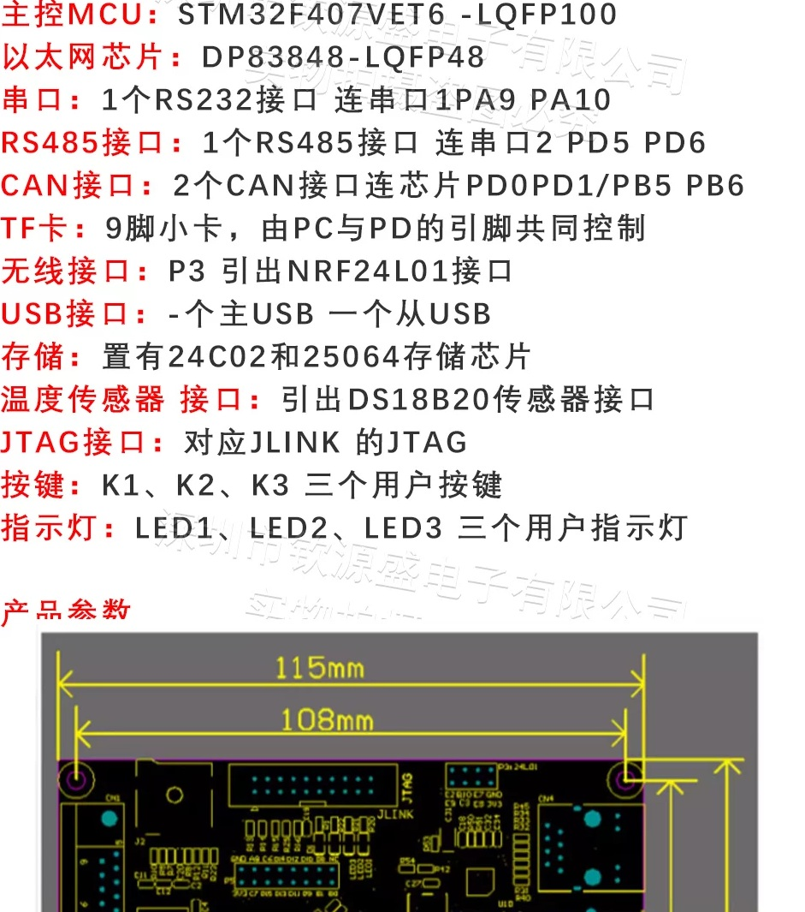
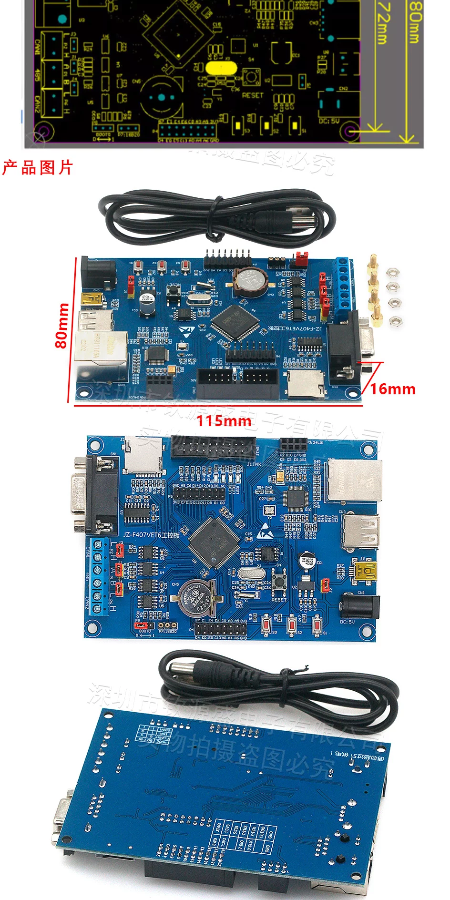

# dev1-f407 — STM32F407VET6 development projects

Bare-metal projects for the **dev1-f407** board (custom **STM32F407VET6**), built
with **CMake/Ninja** (Pico-style), debugged/flashed through a **Keil ULINK2**
(enumerates as a CMSIS-DAP probe) over **SWD**, with `printf()` streamed out
**USART3 (PD8/PD9)** at 115200 baud to the on-board RS232/RS485 transceivers.
Read it with any USB-serial adapter.




Schematic / board manual: `board_sch.pdf`.

> Note on SWV/ITM: the firmware also enables DWT + ITM and the `swv` target is
> still defined, but the ULINK2's CMSIS-DAP firmware cannot capture SWO, so the
> working console is the UART.

## Board facts

- MCU: STM32F407VET6 (Cortex-M4F @ up to 168 MHz, 512 KB flash, 128 KB SRAM)
- HSE crystal **25 MHz**, LSE crystal 32.768 kHz (both fitted)
- LEDs: LED1-**PE13**, LED2-**PE14**, LED3-**PE15**, all **low-level ON**
- Buttons: BTN1-PE10, BTN2-PE11, BTN3-PE12
- On-board: DP83848 PHY, W25Q64 flash, 24C02 EEPROM, CAN/485/232 PHYs
- Console: **USART3** on **PD8 (TX) / PD9 (RX)**, AF7, **115200 8-N-1**
- Debug: Keil ULINK2 on the JTAG header, driven in **SWD** mode (TRACESWO is
  not used)

> ⚠️ **Ethernet (DP83848) is BROKEN on this board.** The PHY is detected on
> MDIO (addr 1, ID `2000:5c90`) and the link negotiates, but the RMII link is
> unstable — it flaps between 10M/100M, drops ~50% of frames, and cannot
> sustain a usable TCP connection (HTTP times out). Confirmed with both this
> repo's `app/eth_http_server` AND a known-good vendor reference project
> (`pav2000/stm32f407-dp83848`) using the same pins — both fail identically.
> This is a **hardware** issue (RMII 50 MHz clock / PHY strap / wiring), not
> software. Do not rely on the Ethernet interface.

## Projects (`app/`)

| Project            | What it does |
| ------------------ | ------------ |
| `app/blink_hello`  | Cycles LED1/2/3 every 250 ms @ 168 MHz + UART banner/tick prints + internal ADC (VREFINT/temp/VBAT) sampling (GCC) |
| `app/dhry_168m`    | Dhrystone 2.1, 2,000,000 runs, GCC **or** armclang, `-Ofast -ffp-contract=fast -funroll-loops` |
| `app/coremark_168m`| CoreMark 1.0.1, 10,000 iterations, GCC **or** armclang, `-Ofast -ffp-contract=fast -funroll-loops` |
| `app/eth_http_server` | HTTP server over Ethernet (DP83848). ⚠️ **BROKEN** — see the Ethernet note above. |
| `app/eeprom_test`  | AT24C02 EEPROM (I2C2: PB8=SCL, PB9=SDA) erase/program/read test |
| `app/spi_flash_test` | W25Q64 SPI flash (SPI1: PE3=CS, PC2=MISO, PB10=SCK, PC3=MOSI) erase/program/read test |

`blink` is built with arm-none-eabi-gcc. The two benchmarks build with either
**arm-none-eabi-gcc** or **Keil Arm Compiler 6 (armclang)** — selected with
`-DSTM32_TOOLCHAIN=gcc|armclang` at configure time — for the C code (GNU as
for the startup file, GNU ld + newlib for linking) at the most aggressive
optimization level. `-DSTM32_LTO=ON` additionally enables GCC LTO.

All projects share the board support in `board/` (168 MHz clock from the 25 MHz
HSE, LED GPIO, UART printf, newlib stubs, ST HAL wiring) and the CMake
helpers in `cmake/`.

## Overall situation / workflow

**How to connect.** Power the board and plug in two USB things:

1. **ULINK2** (or any SWD/CMSIS-DAP probe) on the debug header for flashing
   and reset — `probe-rs` sees it as `Keil ULINK2 CMSIS-DAP`
   (`c251:2722:V0010M9E`).
2. **USB-serial adapter** wired to the on-board RS232/485 transceiver for the
   console — **115200 baud, 8-N-1** (the adapter shows up as e.g. `COM19`).

No extra wiring needed on the board itself; everything lives on the board (see
the photos above and the schematic PDF).

**How to choose a toolchain.** Two options, decided once:

- **Use GCC (recommended for everything going forward).** Open source,
  actively maintained, links with newlib out of the box, LTO works. CoreMark
  lands within ~5 % of armclang. This repo builds `blink` this way.
- **Use armclang (experimental, for benchmark curiosity only).** ~12 %
  faster on Dhrystone, ~5.5 % faster on CoreMark, but Arm Compiler for
  Embedded **6.24 is the final feature release** (defect fixes only), it is
  proprietary, and the C library integration fights GNU ld/newlib (see the
  shims below). Do **not** base new production code on it; if you want an
  actively-developed LLVM compiler, use the open **LLVM Embedded Toolchain**
  instead — it is a normal ELF/LLD toolchain with no ARMCLIB ABI surprises.

**How to flash / run.** In a project's build dir:

```bash
ninja flash        # probe-rs download + reset over ULINK2 SWD (recommended)
ninja flash-ocd    # alternative via OpenOCD
```

**How to verify.** Open the serial console first, then flash (or `probe-rs
reset`) and watch the banner. `blink` prints periodic `blink: LED cycle N`
lines. The benchmarks self-validate: Dhrystone's final values must match its
expected globals, and CoreMark must print `Correct operation validated` with
crcfinal `0x988c`. A machine-verifiable CoreMark pass = the same CRC every
time plus an iteration count within the expected range.

## Toolchain / environment

- arm-none-eabi-gcc 15.3.1 (`D:/Arm/GNU Toolchain mingw-w64-x86_64-arm-none-eabi`)
- Keil Arm Compiler 6 / armclang 6.24.0 (`D:/Keil_v5/ARM/ARMCLANG/bin/armclang.exe`)
- STM32F4 HAL + CMSIS — **vendored** in the repo root `drivers/` (trimmed
  subset of STM32Cube_FW_F4 v1.28.3; see the root `README.md` for how to use
  the full package instead)
- probe-rs 0.32 (`cargo install probe-rs-tools`) — sees the ULINK2 as `Keil ULINK2 CMSIS-DAP` (`c251:2722:V0010M9E`)
- OpenOCD 0.12 (`C:/msys64/mingw64/bin/openocd.exe`) — alternative flasher
- CMake ≥ 3.13 + Ninja

## armclang hybrid toolchain (benchmarks)

`app/dhry_168m` and `app/coremark_168m` compile C with Keil's **armclang**
(LLVM 20 based), while the startup file is still assembled with GNU `as` and
everything is linked with **GNU ld + newlib** using the same linker script as
the GCC build. See `cmake/armclang-keil-toolchain.cmake`.

Flags: `-Ofast -ffp-contract=fast -funroll-loops` + `-mthumb -mfloat-abi=hard
-mfpu=fpv4-sp-d16`.

Three gotchas are handled in `cmake/`:

1. **`armclang_force_wint_t.h`** — armclang's bundled `stddef.h` shadows LLVM's
   and ignores the `__need_wint_t` protocol, breaking newlib's
   `sys/_types.h` (`unknown type name 'wint_t'`). A forced `-include` shim
   defines `wint_t` first.
2. **`printf_rename.h`** — armclang runs in ARMCLIB "standardlib" mode and
   specializes the *name* `printf` into the ARMCLIB ABI: a call to
   `__2printf` plus hidden references to `_printf_c`/`_printf_d`/... Those
   symbols only exist in ARMCLIB, so the GNU-ld link failed with
   `dangerous relocation: unsupported relocation (__2printf): Unknown
   destination type (ARM/Thumb)`. Renaming `printf` → `bench_printf` via a
   forced `-include` stops the specialization (a plain variadic call is
   emitted); `bench_printf` is a thin `vprintf` wrapper in
   `board/uart_printf.c` (armclang does not specialize `vprintf`), so all
   printf-family output still reaches the UART.
3. **GNU link rule** — CMake's ARMClang module would otherwise configure an
   `armlink`-style executable rule; `cmake/armclang-postproject.cmake`
   restores the GNU driver link after `project()`.

**`-Omax` is not usable here.** armclang accepts `-Omax` (LLVM's `-Omax`), but
`-###` shows it silently adds `-flto -flto-unit`: every object becomes
`.llvm.lto` bitcode with no ELF symbols, which GNU ld cannot consume (it links
a broken binary with no code). armclang `-flto` in general is **not
linkable with GNU ld** for the same reason. GCC `-flto` works fine (plugin
resolves symbols), so `STM32_LTO=ON` is GCC-only. Conclusion: `-Ofast` is the
most aggressive armclang level that produces normal objects here.

Results @ 168 MHz (same board, same 25 MHz HSE clock tree). Normal toolchain
comparison — **no LTO** (LTO invalidates Dhrystone; see
`app/dhry_168m/LTO_on_dhrystone.md`):

| Benchmark      | GCC 15.3.1            | armclang 6.24.0       |
| -------------- | --------------------- | --------------------- |
| Dhrystone 2.1  | 351,370 Dhrystones/s  | 393,391 Dhrystones/s  |
| Dhrystone      | 1.19 DMIPS/MHz        | 1.33 DMIPS/MHz        |
| CoreMark 1.0.1 | 427.7 iterations/s    | 451.0 iterations/s    |

All armclang and CoreMark runs validate (Dhrystone final values match;
CoreMark `Correct operation validated`, crcfinal `0x988c`).

### Recommendation: do not adopt Arm Compiler 6

armclang is measurably faster here (≈12 % Dhrystone, ≈5.5 % CoreMark), but
this project still recommends **GCC for all production work**, because:

- **Arm Compiler for Embedded 6.24 is the final planned feature release.**
  Arm's release notes state future updates are limited to defect fixes with
  no additional features. It is a maintenance-only, proprietary toolchain.
- It is not a drop-in C library story: outside Keil's µVision/ARMCLIB
  ecosystem it needs the `wint_t` and `printf` shims above to link with
  newlib/GNU ld, and its `-Omax`/LTO are unusable in that setup.
- Arm's actively-developed LLVM compiler is the **open LLVM Embedded
  Toolchain** (normal ELF/LLD, no ARMCLIB ABI). If the armclang-style
  performance matters, re-run this benchmark campaign with that toolchain.

The benchmark numbers and caveats are documented per project in
`app/dhry_168m/README.md` and `app/coremark_168m/README.md`.

## Clock (all projects)

HSE 25 MHz → PLL (M=25, N=336, P=2, Q=7) → **SYSCLK 168 MHz**,
AHB=168, APB1=42, APB2=84, flash latency 5, regulator scale 1 (no overdrive).

## Build / flash / serial console

```bash
cd app/blink && bash build.sh        # or: mkdir build && cd build && cmake -G Ninja .. && ninja
ninja flash                          # probe-rs download, ULINK2 SWD (selected via --probe c251:2722:V0010M9E)
```

Or flash with OpenOCD: `ninja flash-ocd`.

Read the console with a USB-serial adapter wired to the RS232/485 transceiver:
**115200 baud, 8-N-1**. Example with the CMSIS-DAP_LU virtual COM port
(`VID_251&PID_F001`, seen as e.g. `COM19`):

```powershell
# PowerShell: dump 15 s of console output
$sp = New-Object System.IO.Ports.SerialPort('COM19',115200,[System.IO.Ports.Parity]::None,8,[System.IO.Ports.StopBits]::One)
$sp.ReadTimeout = 15000; $sp.Open()
$sb = New-Object System.Text.StringBuilder
$deadline = [DateTime]::Now.AddSeconds(15)
while([DateTime]::Now -lt $deadline){ try { $b = $sp.ReadExisting(); if($b){ [void]$sb.Append($b) } else { Start-Sleep -Milliseconds 200 } } catch { break } }
$sp.Close(); $sb.ToString()
```

Example blink console output:

```
blink: LED cycle 16 @ 16089 ms
blink: LED cycle 18 @ 18100 ms
```

> The ULINK2 probe must be selected explicitly (`--probe c251:2722:V0010M9E`)
> when another CMSIS-DAP device (e.g. the serial adapter) is also plugged in,
> otherwise probe-rs picks the first probe it finds.

## SWV / ITM printf (optional, needs an SWO-capable probe)

The firmware enables DWT + ITM (stimulus port 0) so `SWV_PutChar()` would work
with a probe that can capture SWO. `probe-rs itm swo` syntax (0.32) is:

```bash
probe-rs itm --probe <PROBE> --chip STM32F407VE --protocol swd --non-interactive swo 600000 168000000 2000000
```

TPIU clock = HCLK = **168 MHz**, SWO baud **2 Mbaud** (prescaler 84).
The ULINK2 in CMSIS-DAP mode reports "Requested SWO mode is not available on
this probe", so use an ST-Link/J-Link/DAPLink if you need SWV.
