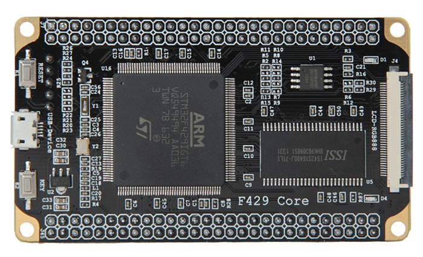
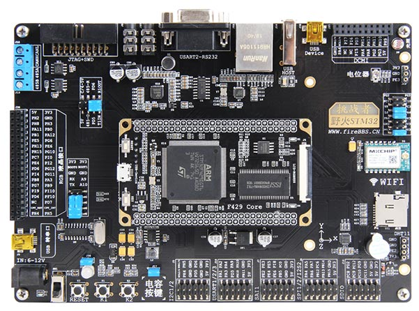

# fire-f429 — STM32F429IGT6 development projects

Bare-metal projects for the **fire-f429** board (STM32F429IGT6, F42x/F43x
family), built with **CMake/Ninja** (Pico-style), debugged/flashed over
**SWD** with a **Keil ULINK2** (CMSIS-DAP), with `printf()` streamed out
**USART1 (PA9/PA10)** at 115200 baud via a USB-serial virtual COM port.




## Board facts

- MCU: **STM32F429IGT6** (Cortex-M4F @ up to **180 MHz**, FPU)
- Flash **1 MB** (`0x08000000`)
- SRAM **256 KB** = SRAM1 **112 K** + SRAM2 **16 K** + SRAM3 **64 K**
  (contiguous, `0x20000000`) + CCM **64 K** (`0x10000000`, not used by linker)
- HSE crystal **25 MHz**, LSE **32.768 kHz**
- LEDs (all **low-active**, LOW = ON):
  - **LED_R** — PH10
  - **LED_G** — PH11
  - **LED_B** — PH12
  - **LED_1** — PD12
- Default LED demos use **LED_1 (PD12)**. The RGB LEDs share pins with the DVI
  interface and are reserved for demos that explicitly need them.
- Console: **USART1** on **PA9 (TX) / PA10 (RX)**, AF7, **115200 8-N-1**
- Debug: **Keil ULINK2** (CMSIS-DAP, SWD) — probe selector `c251:2722:V0010M9E`

> ⚠ **DVI interface / RGB LEDs:** the board also carries a DVI interface. When
> the **DVI interface is used**, `LED_R`/`LED_G`/`LED_B` (PH10/PH11/PH12) must
> be **disconnected from the MCU by the on-board jumpers** (they share the DVI
> data lines). For plain LED use, keep the jumpers fitted.

## Projects

| Folder      | What it is                                                |
| ----------- | --------------------------------------------------------- |
| `bare/`     | **Bare-metal** projects — use only the built-in flash + SRAM |
| `app/`      | Projects using **remapped external SDRAM**                |

- `bare/blink_hello` — LED blink + ADC internal-channel demo (LEDs blink one
  by one; prints the 180 MHz clock and VREFINT / temperature / VBAT over USART1).
- `bare/dhry_180m` — Dhrystone 2.1, 2,000,000 runs (GCC, armclang **or**
  starm-clang). Measured GCC: **391,236 Dhrystones/s, 1.237 DMIPS/MHz**;
  armclang **445,434 / 1.408**; starm-clang **444,346 / 1.405**. See its README.
- `bare/coremark_180m` — CoreMark 1.0.1, 10,000 iterations (GCC, armclang **or**
  starm-clang). Measured GCC: **495.32 iterations/s**, armclang `-Omax`
  **599.20**, starm-clang **448.01**; crcfinal `0x988c`. See its README.
- `bare/coremark_sram` — CoreMark with the timed kernel in **SRAM1**
  (0x20000000); SRAM1 beats SRAM3 ~1.51×, so only SRAM1 is kept. Measured
  gcc 382.57 / armclang `-Omax` 450.05 / starm-clang 339.03 it/s. See its README.
- `app/board_hello` — board self-test (renamed from `app/blink_hello`): LED
  blink + ADC internal channels (VREFINT / temperature / VBAT), GL5516 light
  sensor on PA4 (raw code + mV), DHT11 on PE2, MPU6050 6-axis on I2C1
  (PB6/PB7). `.data`, `.bss`, and heap located in onboard SDRAM;
  `SystemInit()` initializes SDRAM through the HAL before the C runtime
  copies `.data` and clears `.bss`. Verified on hardware. See its README.
- `app/dhry_180m` — Dhrystone with runtime data in SDRAM. Measured GCC:
  **174,611 Dhrystones/s, 0.552 DMIPS/MHz**; starm-clang 213,061 / 0.674.
- `app/coremark_180m` — CoreMark with runtime data in SDRAM. Measured GCC:
  **194.39 iterations/s** (armclang `-Omax` 231.59, starm-clang 196.75),
  crcfinal `0x988c`.
- `app/coremark_sram` — CoreMark with the timed kernel in **SRAM1** and
  runtime data in SDRAM (mixed-memory case). Measured GCC **168.57** / armclang
  `-Omax` **200.45** / starm-clang **168.10** it/s, crcfinal `0x988c`.
- `bare/spi_flash_test` and `app/spi_flash_test` — W25Q128FVSG erase/program/read
  comparison using internal-SRAM versus SDRAM-resident buffers. Both report
  JEDEC `0xEF4018` and pass verification; see their READMEs for measurements.
- `bare/ee_flash_test` and `app/ee_flash_test` — AT24C02 EEPROM erase/program/read
  comparison using internal-SRAM versus SDRAM-resident buffers. Both pass
  verification; see their READMEs for measurements.
- `app/wifi_scan` — Wi-Fi AP scan with the on-board **EMW1062** (AP6181 /
  BCM43362) module over SDIO1, using the vendored WICED/WWD SDK in
  `drivers/wifi_ap6181`. Prints SSID / BSSID / RSSI / channel over USART1.
  Verified on hardware: sees the surrounding 2.4 GHz APs. See its README.
- `app/wifi_connect` — joins the configured AP and prints the DHCP-assigned
  IP over USART1. Credentials live in a gitignored `src/wifi_config.h`
  (template `wifi_config.h.example`). Verified on hardware. See its README.
- `app/wifi_http_server` — joins the AP + DHCP, then serves the **e_server**
  single-page site + JSON API (LED control, ADC/sensors, board info) over
  lwIP raw TCP on port 80. The site is generated from `e_server/web` +
  `e_server/public` at build time. See its README.
- `app/eth_http_server` — same e_server site + JSON API over **wired
  Ethernet** (on-board LAN8720A PHY, RMII, lwIP NO_SYS raw API, static IP
  192.168.5.200). Also serves a **live OV5640 camera stream** (`/stream`,
  `/capture`, RGB565 QQVGA 160x120 converted to 24-bit BMP, ~19 fps via
  DCMI+DMA). Verified on hardware: LAN8720A PHY OK (ID 0007:c0f1), camera
  streaming live distinct frames. See its README.
- `app/capsense_buz_test` — capacitive touch pad (PA5, TIM2_CH1 input
  capture) drives the active buzzer (PI11, NPN BJT, HIGH = ON) while
  pressed, with a 500 ms minimum ON period. Verified on hardware. See its
  README.
- `app/rec_play_test` — capsense-driven 30 s microphone **record & playback**
  with the WM8978 codec on full-duplex I2S2 (44.1 kHz / 16-bit / stereo);
  the PCM stays in the onboard SDRAM (no SD card/FatFs). The PD12 LED is on
  while recording/playing. See its README.

## Vendored libraries

- `drivers/wifi_ap6181/` — the AP6181 (BCM43362) WiFi SDK, including the
  **WICED fork of lwIP 2.0.3** (mandatory for the WiFi apps; its `memp.h`
  pulls WICED platform headers).
- `drivers/lwip/` — plain **lwIP STABLE-2_2_1** (core + netif), used by
  `app/eth_http_server`. Clean release, unified `include/` layout; coexists
  with the WICED fork (different apps, different stacks).

## Creating a project

Use the shared board layer in the project's `CMakeLists.txt`:

```cmake
include(${CMAKE_CURRENT_SOURCE_DIR}/../../cmake/stm32f429_board.cmake)
stm32f429_apply_board(${PROJECT_NAME}.elf "-O1")
```

The benchmark projects select a compiler with
`-DSTM32_TOOLCHAIN=gcc|armclang|starm-clang` at configure time (gcc default;
armclang = Keil AC6 C + GNU as/ld; starm-clang = ST LLVM 21 + LLD). The
benchmarks also expose `-DBENCH_OPT="..."` / `-DBENCH_OPT_C="..."` (C-only
flags) for the aggressive tuning recipes documented in each README.

> **Flashing starm-clang builds:** its `.hex` passes probe-rs/pyOCD verify, but
> OpenOCD's checksum-verify rejects it intermittently — use `ninja flash-probe`
> or `ninja flash-pyocd` for starm-clang builds.

For a bare-metal project, omit `DATA_IN_ExtSDRAM` and use the default linker
script `board/stm32f429igt6.ld`; `.data`, `.bss`, and heap stay in internal
SRAM. For an SDRAM-remapped project, set
`STM32_LINKER_SCRIPT` to `board/stm32f429_sdram.ld` and define
`DATA_IN_ExtSDRAM` on the target. The shared startup then initializes SDRAM
before copying `.data` or clearing `.bss`; the early HAL state stays in
internal RAM.

## CCM RAM (0x10000000)

The 64 KB **CCM** (Core Coupled Memory) is CPU-only (D-bus, 0 wait states —
not accessible by DMA/AHB masters). The linker script uses it for:

- the **.ccmram** section — variables placed there explicitly via
  `__attribute__((section(".ccmram")))`,
- the **stack** (`.stack`, NOLOAD) — CPU-only access, so SRAM1/2/3 stay fully
  available to the application and AHB masters.

The heap lives in normal SRAM (limit = top of RAM, `_eram`).

## Clock tree (180 MHz)

```
HSE 25 MHz → PLL (M=25, N=360, P=2, Q=7) → SYSCLK 180 MHz
  AHB=180, APB1=45, APB2=90, flash latency 6, VOS scale 1
```

## Build / flash / serial console

```bash
cd bare/blink_hello && bash build.sh        # or: mkdir build && cd build && cmake -G Ninja .. && ninja
ninja flash                                 # OpenOCD (default; ~3 s, verify+reset)
ninja flash-probe                           # probe-rs (~11 s)
ninja flash-pyocd                           # pyOCD (~9 s)
```

Flash methods (measured on this board, ULINK2, ~45 KB image, erased baseline):

| Method    | Command (ninja)  | Time   | Notes                         |
| --------- | ---------------- | ------ | ----------------------------- |
| OpenOCD   | `flash`          | ~3.3 s | default: fastest, verified+reset |
| pyOCD     | `flash-pyocd`    | ~9 s   | ~7 s overhead when identical  |
| probe-rs  | `flash-probe`    | ~11 s  | erase + verify + reset        |

Read the console on the USB-serial virtual COM port (COMxx): **115200 baud,
8-N-1**. Example with PowerShell:

```powershell
$sp = New-Object System.IO.Ports.SerialPort('COM36',115200,[System.IO.Ports.Parity]::None,8,[System.IO.Ports.StopBits]::One)
$sp.ReadTimeout = 15000; $sp.Open()
$sb = New-Object System.Text.StringBuilder
$deadline = [DateTime]::Now.AddSeconds(15)
while([DateTime]::Now -lt $deadline){ try { $b = $sp.ReadExisting(); if($b){ [void]$sb.Append($b) } else { Start-Sleep -Milliseconds 200 } } catch { break } }
$sp.Close(); $sb.ToString()
```