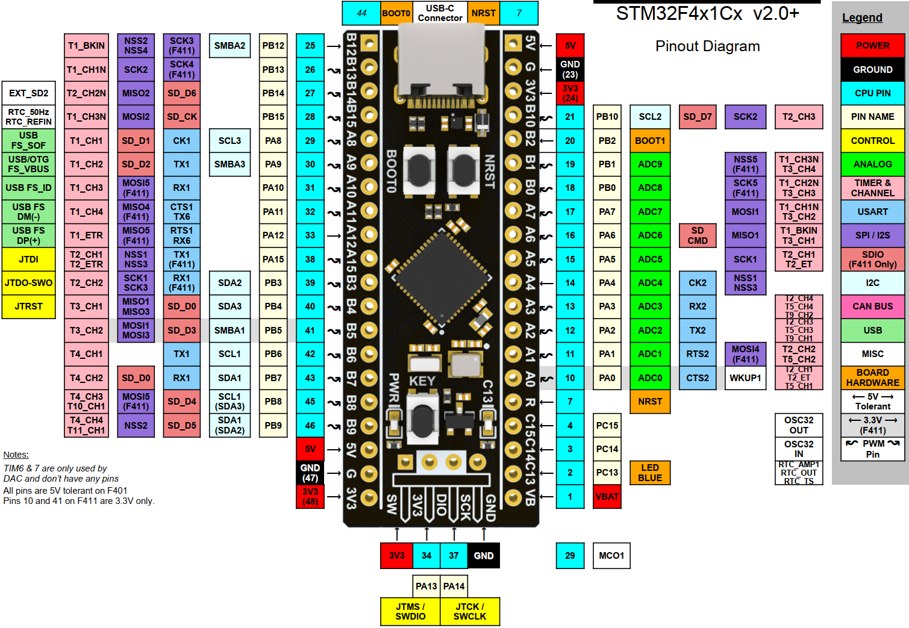
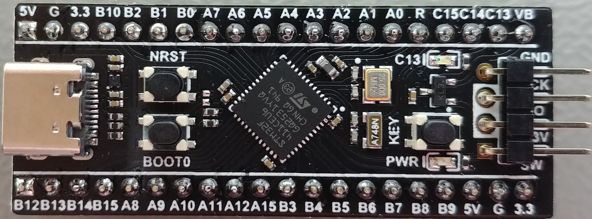

# nano-f411 — STM32F411CEU6 development projects

Bare-metal projects for the **nano-f411** board (STM32F411CEU6), built with
**CMake/Ninja** (Pico-style), debugged/flashed through an **ST-Link** over
**SWD**, with `printf()` streamed out **USART1 (PA9/PA10)** at 115200 baud —
the ST-Link's **virtual COM port (VCP)** is the console.





> Note on SWV/ITM: the firmware enables DWT + ITM (the F411's SWO output is
> available on **TRACESWO = PB3, AF0**), but the ST-Link VCP UART is the console;
> SWO capture is simply not used.

## Board facts

- MCU: **STM32F411CEU6** (Cortex-M4F @ up to 100 MHz, 512 KB flash, 128 KB SRAM)
- HSE crystal **25 MHz**
- LED: **PC13**, single, **low-active** (`LED_ON()` = GPIO_PIN_RESET)
- User button: **PA0**, momentary, **active-low** (`BTN_PRESSED()` = pin == 0)
- Console: **USART1** on **PA9 (TX) / PA10 (RX)**, AF7, **115200 8-N-1** → ST-Link VCP
- Debug: **ST-Link** (V2/V3) over SWD; probe-rs chip name `STM32F411CE`, auto-detected

Hardware photos: `board_images/` (`board_1.jpg`, `board_2.jpg`, `board_3.jpg`).

## Projects (`app/`)

| Project              | What it does |
| -------------------- | ------------ |
| `app/blink_hello`    | Blinks the PC13 LED + samples the **ADC1 internal channels** (temperature/VREFINT/VBAT on the shared IN18 input) and prints them |
| `app/st7735_test`    | **ST7735S 1.44" 128x128** LCD (MD144) via bit-banged 4-wire SPI (SCL=PA5 SDA=PA6 RES=PA7 DC=PA4 CS=PB8), vendor `C8T6_md144_t1` demo loop; backlight **BL=PB9 TIM4_CH4 ~20% PWM** |
| `app/dhry_100m`      | Dhrystone 2.1, 2,000,000 runs, GCC **or** armclang, `-Ofast -ffp-contract=fast -funroll-loops` |
| `app/coremark_100m`  | CoreMark 1.0.1, 10,000 iterations, GCC **or** armclang **or** starm-clang, `-Ofast`-class flags |
| `app/coremark_sram`  | CoreMark with the timed kernel linked into **SRAM** (0x20000000) and copy-in'd at startup; SysTick timing |

The two benchmarks build with either **arm-none-eabi-gcc**, **Keil Arm
Compiler 6 (armclang)** or — where supported — **ST Arm clang**, selected with
`-DSTM32_TOOLCHAIN=gcc|armclang|starm-clang` at configure time. All projects
share the board support in `board/` (100 MHz clock from the 25 MHz HSE, PC13
LED, PA0 button, USART1 console, newlib stubs, ST HAL wiring) and the CMake
helpers in `cmake/`.

> ⚠ **Do not use LTO for Dhrystone.** GCC `-flto` hoists loop-invariant work
> out of the timed region and inflates the score ~2.1× (still passing the
> checks). See `app/dhry_100m/LTO_on_dhrystone.md`.

## RAM code-execution

Shared `.ram_code` support lives in `board/` (startup copy-in loop + linker
`PROVIDE` defaults + `BOARD_LINKER_SCRIPT` in the CMake board helper).

- **SRAM is a single 128 KB block** at 0x20000000 — there is no SRAM1/SRAM2
  split on the F411. `coremark_sram` executes the timed CoreMark kernel from
  its base (copied in from flash at startup), isolating CPU+SRAM throughput
  from the ART-cached flash.

## ADC internal channels (blink_hello)

The internal channels of the **ADC1** peripheral:

| Channel | What it is |
| ------- | ---------- |
| **ADC1_IN17** | VREFINT (internal reference, ~1.21 V) |
| **ADC1_IN18** | Temperature sensor **or** VBAT (shared input) |

> The temperature sensor and VBAT are **both** on IN18. The `TSVREFE` / `VBATE`
> bits in `ADC1->CCR` pick which path is connected (mutually exclusive), and the
> temp sensor also gates VREFINT — so VBAT gets a second, separate conversion
> pass. VBAT is measured through an internal 1/4 divider. VREFINT is used to
> back out the supply voltage, which then scales the temperature and VBAT
> readings.

Example output (once per second):

```
ADC1: temp=947 code, VREFINT=1498 code, VBAT=991 code
     Vdda ~= 3308 mV, chip temp ~= 30 C, VBAT ~= 3200 mV
```

## Clock tree (100 MHz)

```
HSE 25 MHz → PLL (M=25, N=200, P=2, Q=4) → SYSCLK 100 MHz
  AHB=100, APB1=50, APB2=50, flash latency 3, scale 1
```

(PLLQ=4 gives 50 MHz for the PLL48CLK — USB needs 48 MHz, so USB is out of
spec here; none of these projects use USB.)

## Build / flash / serial console

```bash
cd app/blink_hello && bash build.sh        # or: mkdir build && cd build && cmake -G Ninja .. && ninja
ninja flash                                # probe-rs download + reset over ST-Link SWD (auto-detected)
```

Or flash with OpenOCD: `ninja flash-ocd`.

To pin a specific ST-Link, pass `-DDEBUG_PROBE=<selector>` at configure time
(see `probe-rs list` for the selector, e.g. `0483:374b:xxxx`).

Read the console on the **ST-Link virtual COM port** (the ST-Link VCP shows up
as a `COMxx`): **115200 baud, 8-N-1**. Example with PowerShell:

```powershell
$sp = New-Object System.IO.Ports.SerialPort('COMxx',115200,[System.IO.Ports.Parity]::None,8,[System.IO.Ports.StopBits]::One)
$sp.ReadTimeout = 15000; $sp.Open()
$sb = New-Object System.Text.StringBuilder
$deadline = [DateTime]::Now.AddSeconds(15)
while([DateTime]::Now -lt $deadline){ try { $b = $sp.ReadExisting(); if($b){ [void]$sb.Append($b) } else { Start-Sleep -Milliseconds 200 } } catch { break } }
$sp.Close(); $sb.ToString()
```