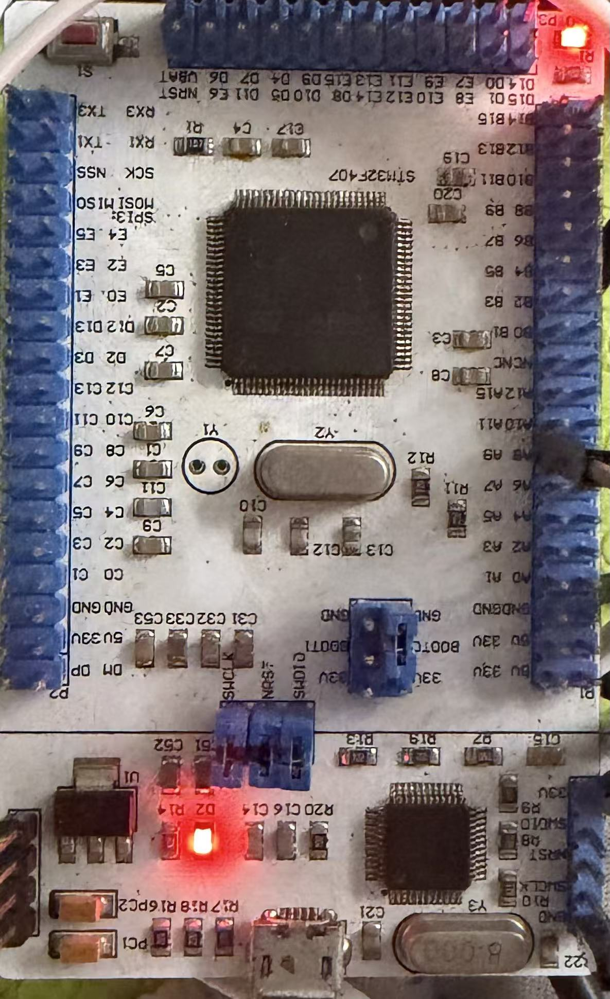

# nano — STM32F407VET6 development projects

Bare-metal projects for the **nano** board (STM32F407VET6), built with
**CMake/Ninja** (Pico-style), debugged/flashed through an **ST-Link** over
**SWD**, with `printf()` streamed out **USART1 (PA9/PA10)** at 115200 baud —
the ST-Link's **virtual COM port (VCP)** is the console.



> Note on SWV/ITM: the firmware also enables DWT + ITM, but the ST-Link VCP
> UART is the console; SWO capture is not used.

## Board facts

- MCU: STM32F407VET6 (Cortex-M4F @ up to 168 MHz, 512 KB flash, 128 KB SRAM)
- HSE crystal **8 MHz**
- LED: **PB0**, single, **low-active** (`LED_ON()` = GPIO_PIN_RESET)
- Console: **USART1** on **PA9 (TX) / PA10 (RX)**, AF7, **115200 8-N-1** → ST-Link VCP
- Debug: **ST-Link** (V2/V3) over SWD; probe-rs auto-detects it

## Projects (`app/`)

| Project              | What it does |
| -------------------- | ------------ |
| `app/blink_hello`    | Blinks the PB0 LED + samples the three **ADC1 internal channels** (temperature IN16, VREFINT IN17, VBAT IN18) and prints them (GCC) |
| `app/dhry_168m`      | Dhrystone 2.1, 2,000,000 runs, GCC **or** armclang, `-Ofast -ffp-contract=fast -funroll-loops` |
| `app/coremark_168m`  | CoreMark 1.0.1, 10,000 iterations, GCC **or** armclang, `-Ofast -ffp-contract=fast -funroll-loops` |

`blink_hello` is built with arm-none-eabi-gcc. The two benchmarks build with
either **arm-none-eabi-gcc** or **Keil Arm Compiler 6 (armclang)** — selected
with `-DSTM32_TOOLCHAIN=gcc|armclang` at configure time. All projects share
the board support in `board/` (168 MHz clock from the 8 MHz HSE, PB0 LED,
USART1 console, newlib stubs, ST HAL wiring) and the CMake helpers in
`cmake/`.

## ADC internal channels (blink_hello)

The three internal channels of the **master ADC1** peripheral are sampled in a
single scan:

| Channel | What it is |
| ------- | ---------- |
| **ADC1_IN16** | Temperature sensor |
| **ADC1_IN17** | VREFINT (internal reference, ~1.21 V) |
| **ADC1_IN18** | VBAT (battery/backup supply) |

> These are only available on ADC1. This F407 is an **F40x/F41x** device, so
> the temperature sensor is on **IN16** (unlike F42x/F43x where it shares
> IN18 with VBAT). VREFINT is used to compute the actual supply voltage, which
> then scales the temperature and VBAT readings.

Example output (once per second):

```
ADC1: temp=978 code, VREFINT=1510 code, VBAT=240 code
     Vdda ~= 3281 mV, chip temp ~= 40 C, VBAT ~= 384 mV
```

## Clock tree (168 MHz)

```
HSE 8 MHz → PLL (M=8, N=336, P=2, Q=7) → SYSCLK 168 MHz
  AHB=168, APB1=42, APB2=84, flash latency 5, scale 1
```

## Build / flash / serial console

```bash
cd app/blink_hello && bash build.sh        # or: mkdir build && cd build && cmake -G Ninja .. && ninja
ninja flash                                # probe-rs download + reset over ST-Link SWD (auto-detected)
```

Or flash with OpenOCD: `ninja flash-ocd`.

To pin a specific ST-Link, pass `-DDEBUG_PROBE=<selector>` at configure time
(see `probe-rs list` for the selector, e.g. `0483:374b:xxxx`).

Read the console on the **ST-Link virtual COM port** (the ST-Link VCP shows up
as a `COMxx`): **115200 baud, 8-N-1**. Example with PowerShell:

```powershell
$sp = New-Object System.IO.Ports.SerialPort('COMxx',115200,[System.IO.Ports.Parity]::None,8,[System.IO.Ports.StopBits]::One)
$sp.ReadTimeout = 15000; $sp.Open()
$sb = New-Object System.Text.StringBuilder
$deadline = [DateTime]::Now.AddSeconds(15)
while([DateTime]::Now -lt $deadline){ try { $b = $sp.ReadExisting(); if($b){ [void]$sb.Append($b) } else { Start-Sleep -Milliseconds 200 } } catch { break } }
$sp.Close(); $sb.ToString()
```
